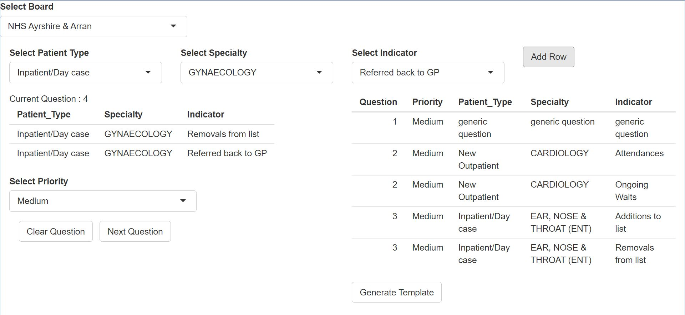

# sot-dq-questions

Shiny app to automate the process of filling out the SoT data quality questions template

## Setup

1. Clone this repository into somewhere on the stats drive and open it in posit
2. Once opened, run the command `renv::restore()` in the posit console.
This sets up your version of the project with the same packages used to develop it
and will take a couple of hours but can just be left to run.
Once this has been run the required packages will be saved into your renv cache
so in the future any time these package versions need to be loaded by any
project that uses renv it will be very quick.

## Usage

Run the shiny app by opening `app.R` and clicking 'Run App'

Once the app opens you will be met with this screen:

Select your board and begin adding specialties to your question using the
dropdowns and the 'Add Row' button. These dropdowns should update to only
allow selection of specialties and indicators present in the data for that
board/spec combo. When your question is finished click 'Next Question' and
continue specifying your patient type/specialty/indicator combos for each
question subsequent question.

Once you have completed the specification of your template click the 
'Generate Template' button. The app will close automatically and the template
will be saved into the `output/` folder.

## Scripts

### app.R

Main shiny app file

### read_data.R

This reads in the data files which drive the SoT DQ dashboard and wrangles them
for use in the shiny app. This script doesn't need to be run directly. It will
run the first time you open the app and will be rerun if you delete
`temp/data.rds`

### generate_template.R

This script is run once the parameters have been selected in the app. It does
not need to be run directly.